# BHV Workshop: TDCS/Brain Stimulation Badge and How To Use It
 
_Biohacking Village DIY Workshops_
 
As part of our commitment to biohacking and open science, this 2019 DEF CON [Biohacking Village](https://www.villageb.io/)  workshop has been converted to a DIY/at home format. We hope you find this project instructive.
 
## About This Workshop
**Workshop leads:** Jen and Darren 
 
Are you interested in the world of biohacking but don’t know where to start? Are you an experienced grinder who simply wants to learn more about how to hack your own brain? Join us in this hands-on workshop where you will learn about the basics of tDCS as we walk you through how to choose the proper montage, electrode placement, and how to construct your own studies in a sound and scientific manner. All while zapping your brain with a 9 volt battery. What could be more fun?

## DISCLAIMER
The tDCS device provided in this workshop is not intended as a medical device and is not approved by the FDA. The user accepts all risk associated with the advice, guidance, claims, and references provided within this presentation.
By accepting this tDCS device, you are accepting all risk associated with its ownership and usage.
Children, elderly, and people with history of epilepsy, stroke, or implants should consider avoiding DIY tDCS.
Please consult your physician before engaging in DIY tDCS

Transcranial Direct Current Stimulation
* What is tDCS?
* Why tDCS?
* Electrode Placement
* Common Montages
* Device Handout
* Electrode Construction
* Hands on Lab

## WHAT IS tDCS - Overview and History

* “a form of neuromodulation that uses constant, low direct current delivered via electrodes on the head.” 
* By applying voltage to specific neuronal areas and pathways, we can amplify the strength of those connections, thereby increasing (or decreasing) our synaptic amplitude to craft a specific desired outcome.
* https://medium.com/@vagabondbanana/what-is-tdcs-e29ff7288a02

## Why tDCS?

Used in the medical community as well as the DIY community
* Parkinson’s
* ADHD
* Fibromyalgia
* Depression
* Cognitive Enhancement
* Anxiety
* Traumatic Brain Injury (TBI)
* Stroke

## Safety

* tDCS is not approved by the FDA
* “Transcranial devices are not playthings” (Bikson,  Bestmann, & Edwards 2013)
  * https://www.nature.com/articles/501167b
* External use only
* 9V battery only

**Side effects**

* Phosphenes (seeing a flash of light)
  * https://thebrainstimulator.net/faq/experienced-flash-light-turning-device-harmful/
* Skin Irritation
* Tingling or itching
* Metalic taste

## Don't be a dumbass

## Overview - Electrodes
* Electrode - electrical conductor that connects battery to the skin delivering a weak electrical current
* Charge - electrodes are either **anode** (positive (+), red) vs **cathode** (negative (-),black)
  * Anodal stimulation acts to excite neuronal activity
  * Cathodal stimulation inhibits or reduces neuronal activity
* Type - rubber carbon pads, sponge (most common), self-adhesive
* Quality comparison 
  * https://medium.com/@vagabondbanana/is-diy-as-good-as-clinical-commercial-when-it-comes-to-tdcs-electrodes-1fc82fab66eb
  * https://thebrainstimulator.net/choosing-electrodes/

## Electrode Placement

* 10-20 System
  * Internationally recognized way to map out specific points on the scalp for electrode placement
  * In tDCS, we associate these points/regions with activity areas (based on research)
  * We are going to learn the basics of this system, but further research may be required
* Montages - various arrangements of the anode electrode and cathode electrode on the head/body

## Brain
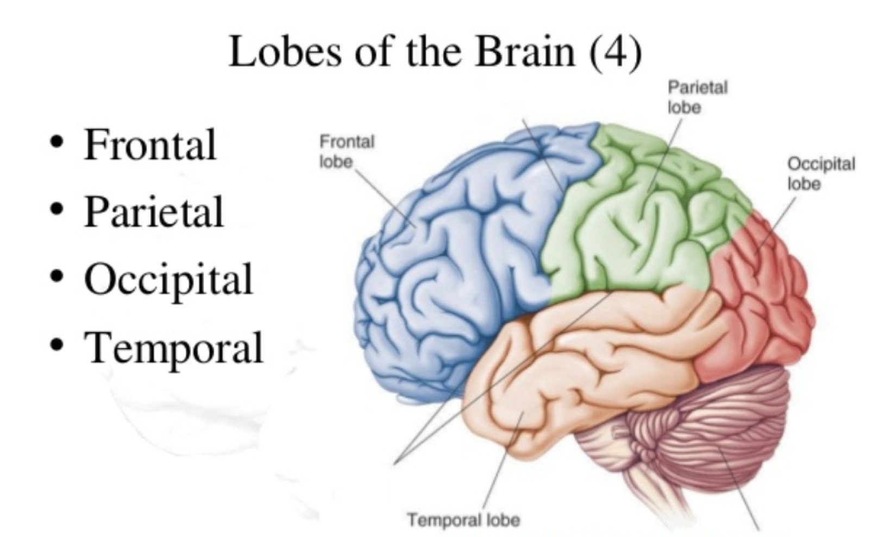 
TDCS focuses on 4 parts of the brain
* Frontal lobe (F)
  * important for cognitive functions and control of voluntary movement or activity
* Parietal lobe (P)
  * processes information about temperature, taste, touch and movement
* Occipita lobe (O)
  * primarily responsible for vision
* Temporal lobe (T)
  * processes memories, integrating them with sensations of taste, sound, sight and touch
When discussing electrodes placement F, P, O, T are used to label points on the scalp,  C is also used to indicate Center midline (from front to back)

## Mapping the Scalp

F, P, O, T - Odd numbers on the left, even on the right

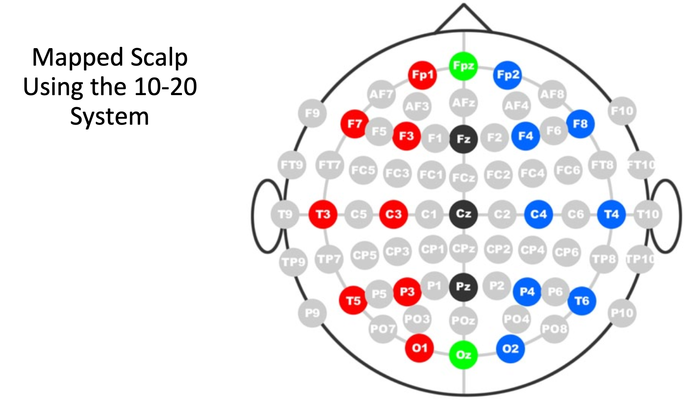 

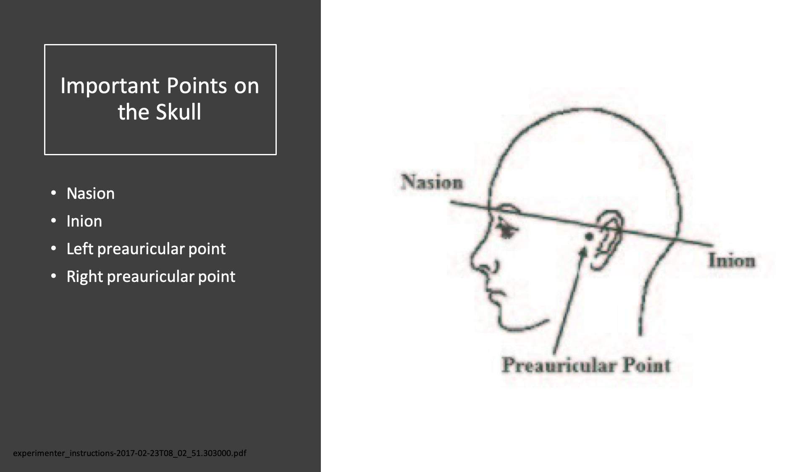 

* LPP 10% to T3, 20% to C3, 20% to Cz, 20% to C4, 20% to T4, 10% to RPP = 100%
* Midline, Nasion 10% to Fpz, 20% to Fz, 20% to Cz, 20% to Pz, 20% to Oz, 10% to Inion = 100%

* How are “WE” going to do this, today?
* For the sake of brevity and getting to the good stuff, we will show you how to map of few of the commonly used electrode placements.
* Using cm side of measuring tape

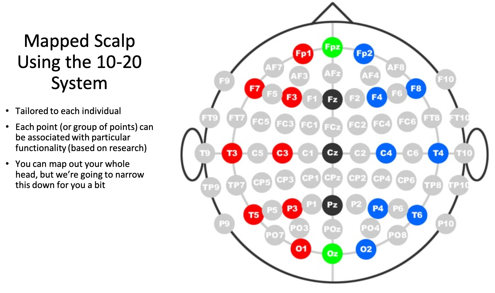 

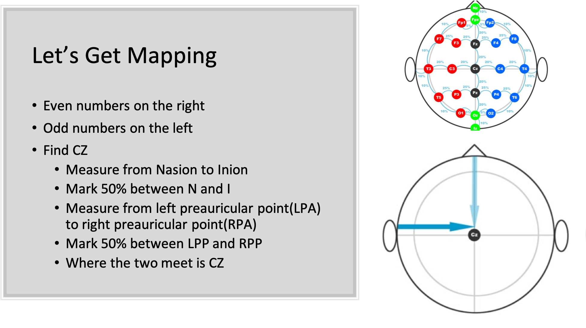 

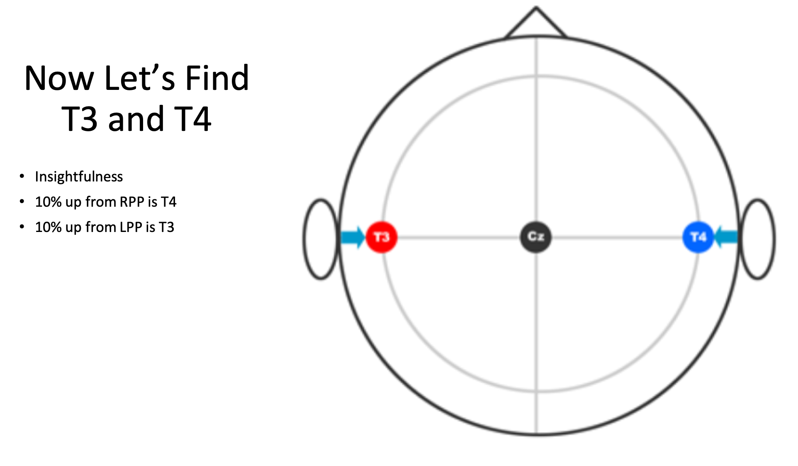 

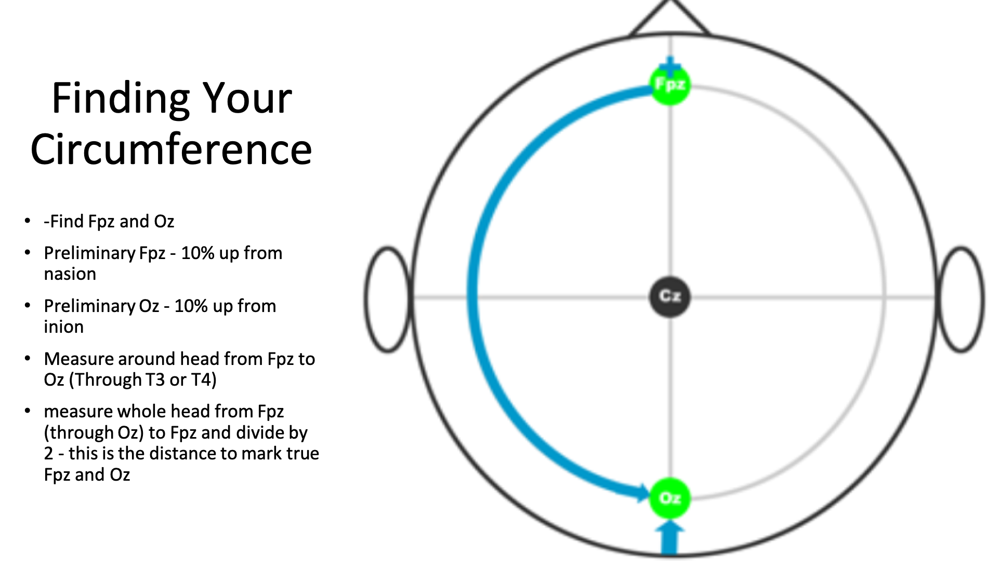 

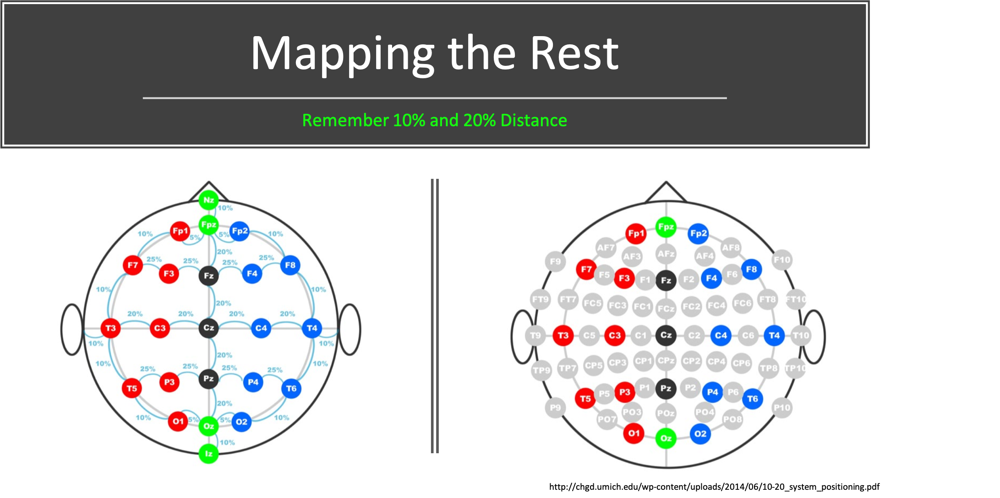 

Measurement methods for placement of the F3, F4, P3, and P4 points differ. If measured front-to-back (Fp1-F3-C3-P3-O1 and Fp2-F4-C4-P4-O2 montages), they can be 25% "up" from the front and back points (Fp1, Fp2, O1, and O2). If measured side-to-side (F7-F3-Fz-F4-F8 and T5-P3-Pz-P4-T6 montages), they can be 25% "up" from the side points (F7, F8, T5, and T6). If measured diagonally, from Nasion to Inion through the C3 and C4 points, they will be 20% in front of and behind the C3 and C4 points. Each of these measurement methods results in different nominal electrode placements.

## Common Locations for tDCS

* Anode F3
  * Depression, SAD - seasonal affective disorder, Generalized anxiety disorder
    * Cathode FP2 (right center forehead)
  * Addiction 
    * Cathode F4 (opposite F3)
* Anode Fp1
  * Attention
    * Cathode left center forehead or right shoulder
  * Anode T4 (10% up from Right preauricular point), T3 (10% up from Left Preauricular point)
* These are 2 inch electrodes, accuracy is a little (slightly/moderately) less important
However...we are scientists...let's be as accurate as possible

## Studies Associated with Montages

* Some are good, some are bad
* Lack of well-structured studies
  * Must be reproducible
  * Many studies have failed in replicating results
* Actively researched in the medical community
  * May not be research in areas you have interest
* Be a good researcher
  * Use the scientific method when creating your experiments
* Pick a study and see if you can replicate (or disprove) the results

* This is not a metastudy on montages
* Recommendation - follow studies and see if you can replicate results
* Many studies that look at the cognitive enhancement benefits of tDCS are poorly designed and lack proper blinding and control conditions.
* Add to the body of knowledge

## Anode F3

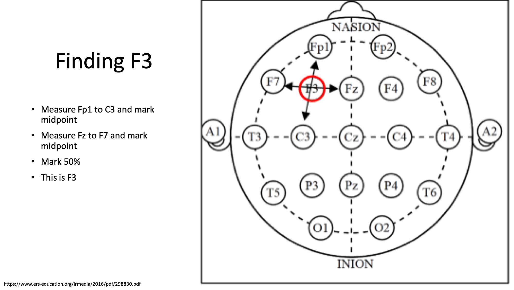 

## Anode F4

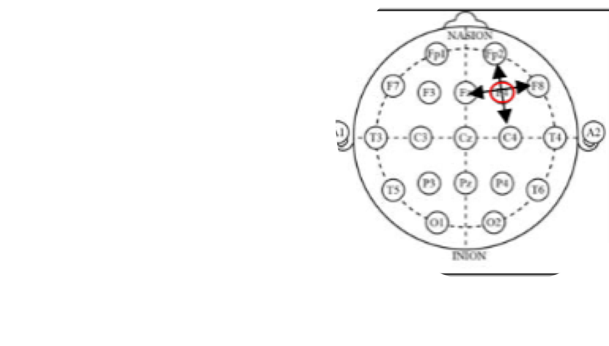 

## Depression

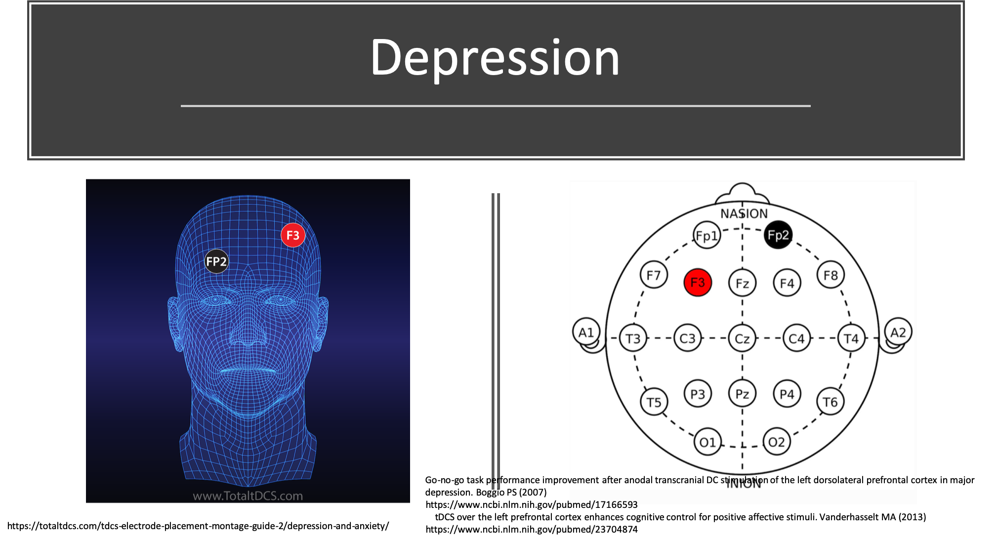 

* Typical stimulation protocols are 1-2 mA for 20 minutes over the left DLPFC.
* The left DLPFC activity is associated with positive emotional processing.

## Addiction

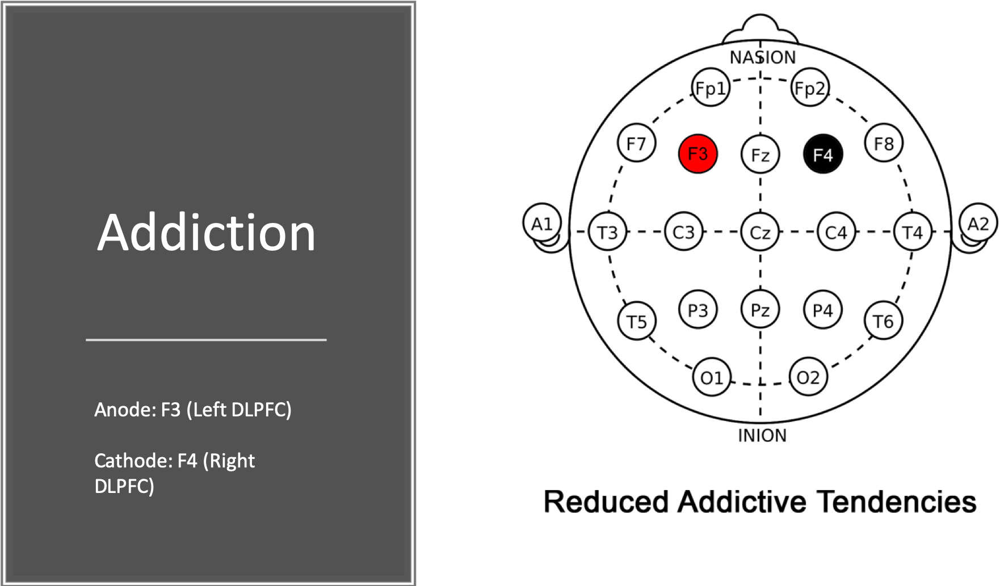 

* Typical stimulation protocol is 2 mA intensity for 20 minutes.
Can potentially be used to reduce addictive behaviors that include cravings for tobacco, food, alcohol and drugs. Can potentially also be used for reducing risk taking behavior.

### Addiction Studies with tDCS

* Cumulative priming effects of cortical stimulation on smoking cue-induced craving. Paulo Sergio Boggio (2009)
* https://www.sciencedirect.com/science/article/abs/pii/S0304394009009793
* A randomized controlled trial of targeted prefrontal cortex modulation with tDCS in patients with alcohol dependence. Jaisa Klauss (2014)
* https://academic.oup.com/ijnp/article/17/11/1793/2910056
* Transcranial direct current stimulation of the prefrontal cortex modulates the desire for specific foods. Felipe Fregni (2013)
* https://www.ncbi.nlm.nih.gov/pmc/articles/PMC3541023/
* Prefrontal cortex transcranial direct current stimulation (tDCS) temporarily reduces food cravings and increases the self-reported ability to resist food in adults with frequent food craving. Rachel L. Goldman (2011)
* Diminishing risk-taking behavior by modulating activity in the prefrontal cortex: A direct current stimulation study. Shirley Fecteau (2007)
* Manipulating Executive Function with Transcranial Direct Current Stimulation. David V. Smith (2009) 

## Insightfulness

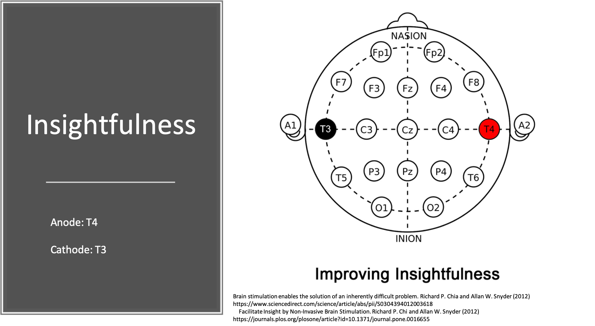 

* Right lateralized tDCS at a max current output 1.6 mA was found to increase the user's ability to solve difficult problems; suggesting this montage may have played a role in mitigating cognitive biases that impede higher creative thinking. 40% of participants were able to find the solution to a difficult problem after receiving right lateralized tDCS, whereas none of the participants were able to solve it beforehand.

* The general understanding so far for this montage is that mental templates and/or cognitive biases may be weakened which is associated with users increasing their insightfulness and ability to find novel meaning in a given set of information.

### Attention Improvement

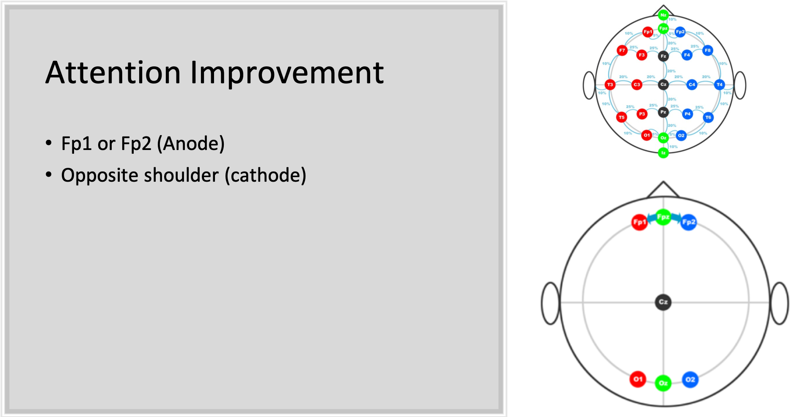 

* Measure and mark 5% of total circumference to the left and right of Fpz. These will be your true Fp1 and Fp2 marks.

## Chronic Pain

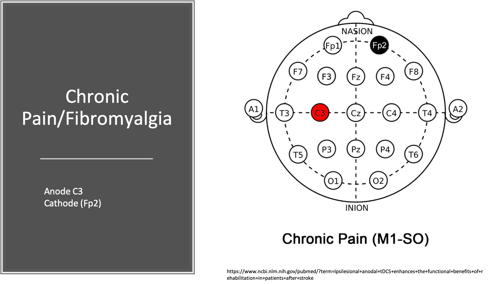 

## ADHD

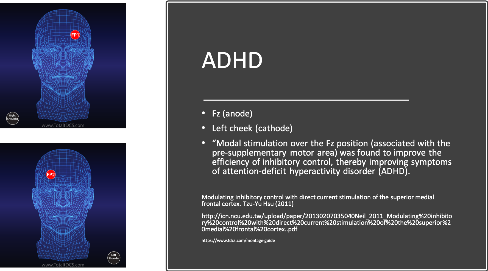 

## Improved Cognition

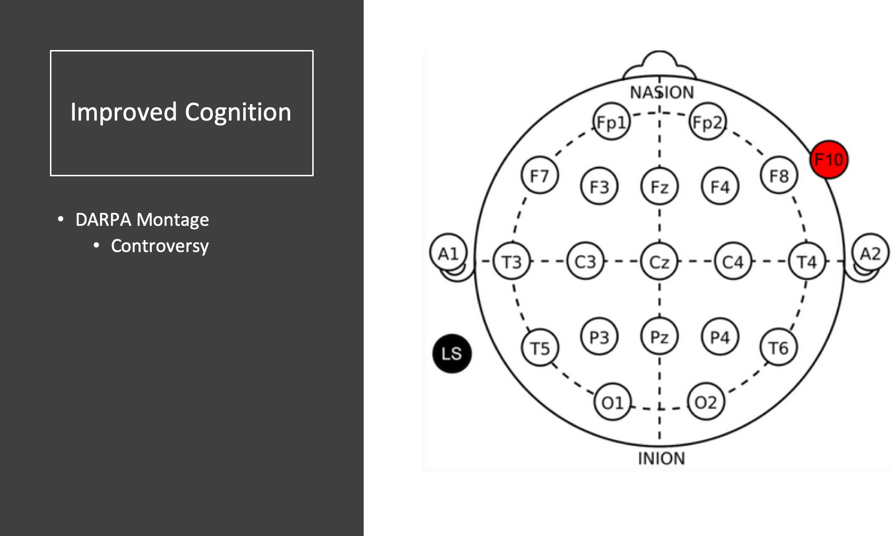 

## Other Montages
https://www.tdcs.com/montage-guide
https://www.reddit.com/r/tDCS/comments/2e7idx/simple_montage_list_with_electrode_placement_and/
https://totaltdcs.com/
https://cdn.shopify.com/s/files/1/3104/9196/files/tDCS_montage_reference_v1_0.pdf?923975672558430024

-----

## What you will need
* Have a brain
* Not suggested for people with a history of epilepsy, has had brain surgery, have a plate in the head
* tDCS Badge
* Electrode kit (4 safety pins, 2 square sponges, 2 squares aluminum mesh, 2 wires with clips)
* 9V Battery
* Measuring tape lanyard
* Headband

 
## Instructions
 Disclaimer
The tDCS device provided in this workshop is not intended as a medical device and is not approved by the FDA. The user accepts all risk associated with the advice, guidance, claims, and references provided within the workshop.

Badge Diagram:

Mapping:
Mapping
Even numbers on the right
Odd numbers on the left
Find CZ
Measure from Nasion to Inion
Mark 50% between N and I
Measure from left preauricular point (LPA) to right preauricular point (RPA)
Mark 50% between LPA and RPA
Where the two meet is CZ

Electrodes:

Safety pins affix aluminum mesh screens to cellulose sponges.
Clips-on wires connect to aluminum mesh. Wires then connect to tDCS board.

Easier to put together when sponges are dampened.
Avoid wrinkles and bunching in mesh
Ensure mesh does not extend beyond the edges of the sponge. Trim if necessary.
Do not put mesh side on skin. Ensure no metal is exposed on the contact side

## Setting up Your Session

* Choose a Protocol
  * Amplitude
  * Duration
  * Montage
* Create saline (conductivity solution)
* Are you going to evaluate your results?

* What is a protocol? What is the approach?
* 1.5mA to 2.0mA – 20 minutes

* 1/8 teaspoon per cup (distilled – maybe boiled and cooled water) – future studies coming

## Badge Overview

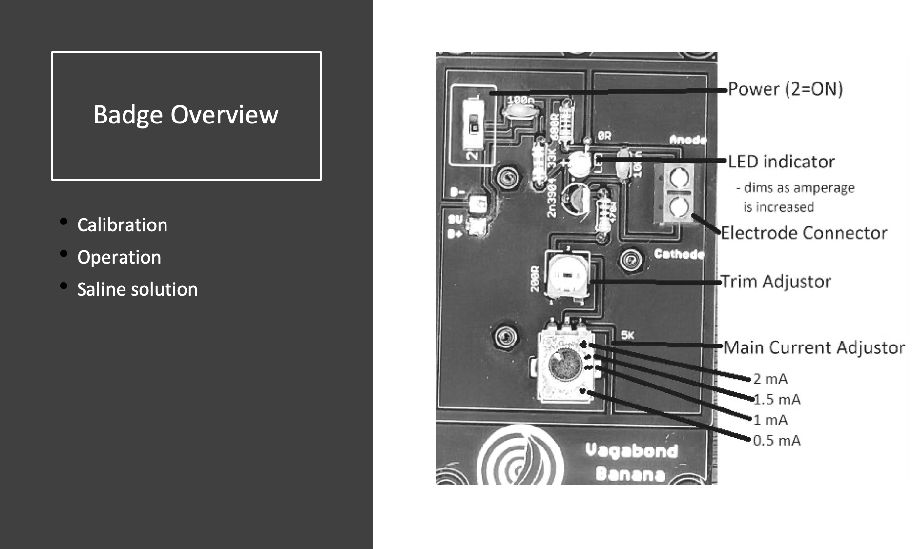 

---
## Another Disclaimer

The tDCS device provided in this workshop is not intended as a medical device and is not approved by the FDA. The user accepts all risk associated with the advice, guidance, claims, and references provided within this presentation.

By accepting this tDCS device, you are accepting all risk associated with its ownership and usage.
Children, elderly, and people with history of epilepsy, stroke, or implants should consider avoiding DIY tDCS.
Please consult your physician before engaging in DIY tDCS

BY ACCEPTING AND/OR USING THIS DEVICE, YOU ACCEPT ALL RISK, RESPONSIBILITY, AND LIABILITY ASSOCIATED WITH IT

---

## Resources

* http://VagabondBanana.com
* http://www.quantified-mind.com/
* https://www.reddit.com/r/tDCS/
* http://chgd.umich.edu/wp-content/uploads/2014/06/10-20_system_positioning.pdf

